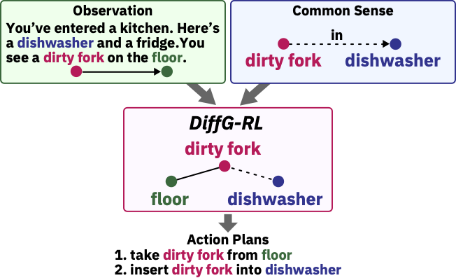

# *DiffG-RL*: Leveraging Difference between State and Common Sense
This repository provides the official implementation of the [*DiffG-RL*: Leveraging Difference between State and Common Sense](https://arxiv.org/abs/2211.16002) by [Tsunehiko Tanaka](https://tsunehiko.github.io/), [Daiki Kimura](http://ibm.biz/daiki-kimura) and [Michiaki Tatsubori](https://researcher.watson.ibm.com/researcher/view.php?person=jp-MICH). The codebase builds upon [TWC](https://github.com/IBM/commonsense-rl).

<div align="center">
  
</div>


## Prepare *DiffG-RL* Environment

Install the following requrirements:
```
conda create -n diffgrl python=3.7 numpy scipy ipython matplotlib
conda activate diffgrl
conda install pytorch=1.8.0 cudatoolkit=11.1 -c pytorch -c conda-forge
conda install nltk gensim networkx unidecode tensorboardX
pip install textworld==1.2.0 SceneGraphParser timm gym==0.22.0
pip install -U spacy
python -m spacy download en_core_web_sm
python -m nltk.downloader 'punkt'
```

Download the [Visual Genome](https://visualgenome.org/) relationship.json:
```
mkdir vg
cd vg
wget http://visualgenome.org/static/data/dataset/relationships.json.zip
unzip relationships.json.zip
rm relationships.json.zip
cd ../
```

Download the requried data:
```
# similar_dicts and games
wget -O data.zip https://ibm.box.com/shared/static/ixynrle7wkidftcih759rnmoefdrdsmq.zip
unzip data.zip
rm data.zip

# ckpt (Optional)
wget -O ckpt.zip https://ibm.box.com/shared/static/zyuhjfi7sm05xprwchicayb1pcgrqmov.zip
unzip ckpt.zip
rm ckpt.zip
```

## Similar Dicts Setup for Extracting by Meaning (Optional)
We extract commonsense triples offline by meaning with word embedding. The generated JSON file contains correspondence between entities in commonsense triples and entities in text-based games. Although we provide the JSON file in the above script, you can extract it yourself using the following command (Output results could be different). Please see the paper for details.
```
python utils/similarity.py --threshold 0.3
```

## AMR Setup for Knowledge Graph Extraction (Optional)

We use Abstract Meaning Representation Parser for knowledge graph extraction. We provide the cache that includes correspondence between sentences and AMR graphs for the case without an AMR server, but the cache cannot cover all sentences. If you have the following error, please consider getting an AMR server.

```
requests.exceptions.ConnectionError: HTTPConnectionPool(host='localhost', port=5000): Max retries exceeded with url: /verbnet_semantics?text=Oh.&use_coreference=0 (Caused by NewConnectionError('<urllib3.connection.HTTPConnection object at 0x7fa481e55b50>: Failed to establish a new connection: [Errno 111] Connection refused'))
```

Please setup Flask server of AMR-CSLogic: https://github.com/IBM/AMR-CSLogic/

And set the port number as AMR_PORT in `DiffGRL_train.sh` and `DiffGRL_test.sh`

## Train on game

Please see script for detailed settings. For example, if you want to change the difficulty to medium, set `DIFFICULTY=medium`. Note that threshold must be set to the same value as threshold in Similar Dicts.
```
./scripts/DiffGRL_train.sh
```

## Test on game (OUT)
You can try the trained models in `ckpt` or your own models.
```
./scripts/DiffGRL_test.sh MODEL_PATH
```

## Bibliographic Citations
If you use our code, please cite us by including the following articles in your work:

```
@inproceedings{tanaka2022diffgrl,
    title={DiffG-RL: Leveraging Difference between State and Common Sense},
    author={Tanaka Tsunehiko, Kimura Daiki and Tatsubori Michiaki},
    year={2022},
    booktitle={Findings of the Association for Computational Linguistics: EMNLP 2022}
}
```

#### Relevant Resources
* TWC https://github.com/IBM/commonsense-rl
* ConceptNet http://conceptnet.io/
* Visual Genome https://visualgenome.org/
* AMR https://github.com/IBM/transition-amr-parser
